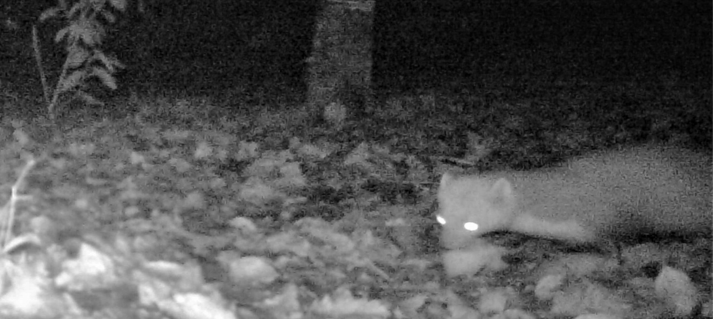

# HoloWeasel

Holoplay and Three.js working example files

## Three.js Holoplayer display

- "Forked" from (https://cabbi.bo/LookingGooey/)
- See it live at (http://logicien.fr/holoweasel/)
- Might be GPU intensive
- Everything should be linted / auto formatted
- Stylesheet in SASS
- Added block comments

## TODO

- Implement advanced controls for cube camera navigation (Space Navigator)
- Implement advanced controls with leapJS.
- Implement 3D objects loading (stl, obj, etc.)
- Convert to Typescript (js is a fugly mess)